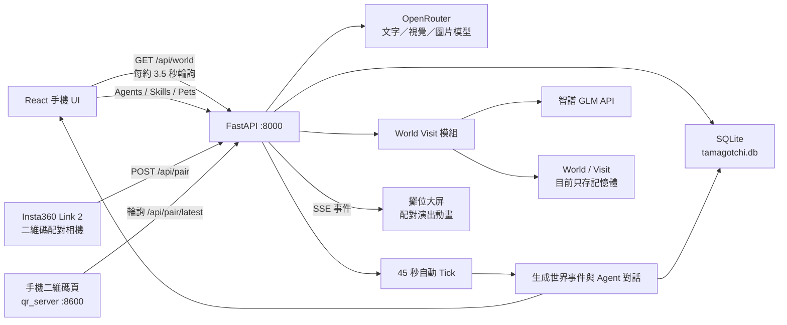

# My Tamagotchi / ForkWorld 後端技術解析

> 範圍：以軟體與後端為主，不包含硬體實作
>
> 最後更新：2026-07-25（補上「兩個人連結」二維碼配對、語音對話、
> LLM JSON 防護與 SQLite 寫鎖修復；模型供應商已換成 SiliconFlow）

## 摘要

目前真正接到手機 UI 的主線是：

- React + TypeScript 手機前端
- FastAPI 共用後端
- SQLModel + SQLite 持久化
- SiliconFlow `deepseek-ai/DeepSeek-V3` 文字模型（OpenAI 相容介面，可換供應商）
- 智譜 GLM 世界生成與世界互訪模組

畫面裡 Agent 自動冒出的聊天泡泡，可能是「世界演化事件」生成 2. 使用者直接與 Agent 聊天。

線下展演的主線則是 **兩個人連結**：兩位主人把 agent 二維碼舉到鏡頭前同框，
觸發 `POST /api/pair` 產生相遇對話、靈魂契合度與技能互學（見 §2.2b）。

---

## 一、目前實際架構



前端預設以 `/api` 呼叫後端，Vite 開發代理指向 `localhost:8000`，也就是 FastAPI。

主要檔案：

- `frontends/mobile/vite.config.ts`
- `frontends/mobile/src/app/backendApi.ts`
- `frontends/mobile/src/app/worldApi.ts`
- `backend/app/main.py`
- `backend/app/world.py`
- `backend/app/llm.py`

---

## 二、Agent 聊天內容如何生成

repo 內有三種不同意義的「聊天」，必須分開理解。

### 2.1 畫面城鎮中的自動聊天泡泡

這是目前 Demo 畫面真正會看到的主要 Agent 對話。

流程如下：

1. FastAPI 啟動後建立背景迴圈。
2. 每 45 秒執行一次 world tick。
3. 隨機選擇世界、地點、事件類型與 2–3 位 Agent。
4. 把 Agent 的名字、物品類型、性格、心情送給 LLM。
5. LLM 回傳事件標題、摘要、3–5 句對話及後續影響。
6. 結果寫入 `worldeventrow`。
7. 參與 Agent 各自新增一筆 `Memory(kind="world")`。
8. 前端約每 3.5 秒讀取 `/api/world`。
9. 前端發現新事件後，依序顯示事件中的對話泡泡。

相關實作：

- 背景 tick：`backend/app/main.py`
- 世界事件生成：`backend/app/world.py`
- 前端輪詢：`frontends/mobile/src/app/useWorldEvolution.ts`
- 對話泡泡：`frontends/mobile/src/app/App.tsx`

#### System Prompt

```text
你是像素小世界的叙事引擎，为几个物品 agent 生成一段小事件。只输出 JSON。
```

#### User Prompt 結構

```text
地点：{location}；事件类型：{etype}。参与者：
agent-{id}: {name}（{category}，性格：{trait}，心情：{mood}）

输出 JSON：
{
  "title": "10字内事件标题",
  "summary": "40字内摘要",
  "dialogue": [
    {"agentId": "agent-数字", "text": "25字内台词"}
  ],
  "consequence": "25字内后续影响"
}
```

目前這個 Prompt 沒有把 Agent 的歷史記憶送入 LLM，因此世界事件對話具備 Agent 人設，但還不算真正基於長期記憶的決策或推理。

### 2.2 使用的模型

FastAPI 透過 OpenAI-compatible 的 `/chat/completions` API 呼叫，供應商由
`backend/.env` 的 `LLM_BASE_URL` 決定，換供應商不用改程式。

**目前實際配置（2026-07-25 更新，已從 OpenRouter 換成 SiliconFlow）**：

```text
LLM_BASE_URL=https://api.siliconflow.cn/v1/chat/completions
LLM_MODEL=deepseek-ai/DeepSeek-V3
LLM_JSON_RESCUE_MODEL=deepseek-ai/DeepSeek-V3
```

> ⚠️ 模型不要往下換到 7B 級：實測 `Qwen/Qwen2.5-7B-Instruct` 在配對這種
> 「長 prompt + 嚴格 JSON schema」的任務下會直接崩壞，輸出退化成重複吐
> `"}` 或只生成一條台詞就截斷，導致所有 LLM 內容全程走兜底文案。

如果沒有 API key、模型失敗或網路失效，則會退回幾句本地預設台詞，例如：

```text
（伸了个懒腰）你回来啦！
今天也要加油哦！
我把这件事记在心里了。
```

這讓 Demo 不會因為 LLM 服務暫時失效而直接回傳 500。

#### JSON 輸出的三層防護（`backend/app/llm.py`）

`chat_json()` 是所有結構化生成的共用入口（世界事件、技能鍛造、記憶蒸餾、
配對）。小模型產生的 JSON 很常壞掉，所以有三層防護：

1. **約束解碼**：先帶 `response_format={"type":"json_object"}` 呼叫，讓服務端
   保證括號閉合；模型不支援時自動退回自由生成再試一次。
2. **殘缺修復** `_repair_json()`：掃括號堆疊補上漏掉的閉合符（模型很愛寫出
   `[{"a":1},{"b":2]` 這種中間漏 `}` 的），並去掉尾逗號。被 `max_tokens`
   截斷、一個閉合符都沒有時也能補完。字串內的括號不計入堆疊。
3. **失敗留痕**：呼叫失敗或解析失敗都會 `print` 出模型名、原因與原始輸出前
   200 字。**這點很重要**——舊版是靜默 `except: continue`，限流／超時／格式
   崩壞全部無聲退回兜底短句，現場只看得到「寵物答非所問」卻查不出原因。

排查 LLM 相關問題時，先看後端 stdout 有沒有 `[llm]` 開頭的行。

### 2.2b 兩個人連結：二維碼配對（`POST /api/pair`）

線下破冰主線。兩位主人各自把手機上的 agent 二維碼舉到鏡頭前同框，兩個
agent 當場「認識」，產出相遇對話、靈魂契合度與技能互學。

#### 鏈路

```text
Insta360 Link 2 相機
→ tools/qr_pair/capture.py     ffmpeg 依「名字」取流（cv2 序號會開錯到內建鏡頭）
→ decoder.py                    WeChatQRCode 多碼解碼（同一幀解出兩個碼）
→ fsm.py                        配對狀態機（雙碼同框達閾值才觸發，帶冷卻）
→ POST /api/pair                後端生成對話 + 契合度 + 技能交換
→ 大屏 bigscreen.html           SSE 推送，播放撞擊演出動畫
→ 手機 qr_server.py             輪詢 /api/pair/latest/{id}，自動翻到結果頁
```

#### 二維碼載荷協議

```text
FW1:<agent_id>          例：FW1:3
```

前綴常數兩邊必須一致：後端 `main.py` 的 `QR_PAIR_PREFIX`、相機側
`tools/qr_pair/config.py` 的 `QR_PREFIX`。

#### 端點

```http
POST /api/pair
Content-Type: application/json

{
  "payload_a": "FW1:1",
  "payload_b": "FW1:3",
  "source": "qr_camera"
}
```

回傳：

```jsonc
{
  "pair_id": "fc0a81887a64",
  "agents": [ /* 兩個 agent_out()，含 image 形象圖 URL */ ],
  "lines": [ {"agent_id": 1, "name": "豆豆", "image": "/api/pets/.../final",
              "text": "墨墨！上次听主人在你面前读诗时打了个喷嚏…"} ],
  "resonance": {"score": 83, "reason": "都执着于记录主人生活里易逝的微光",
                "topic": "讨论如何保存那些深夜独处时的灵感痕迹"},
  "learned": {"learner": "铁蛋", "teacher": "豆豆", "skill": "安慰模式"},
  "cached": false
}
```

```http
GET /api/pair/latest/{agent_id}
```

回傳該 agent 最近一次配對結果（手機二維碼頁輪詢用），沒有則回 `{}`。

#### 配對觸發的三件事

| # | 效果 | 落庫 |
|---|---|---|
| 1 | 相遇對話 4~6 句 | 不落庫，即時演出用 |
| 2 | 兩位主人的靈魂契合度（0-100）與共鳴理由 | 寫入雙方 `Memory(kind="pair")` |
| 3 | 技能互學：一方有對方沒有的技能時 50% 機率學會 | 新增 `Skill(source="learned")` + `Memory(kind="pair")` |

配對後還會非同步觸發雙方的 `_refresh_profile_digest()`，把這次相遇融進
`profile.memory_digest`，所以**配對會影響之後的聊天人設與下一次契合度計算**——
契合度算的就是這份長期積累，`brief()` 會把 digest 一起餵給 LLM。

#### 兩個容易踩的坑（都已修，改動時別改回去）

1. **說話人不能只認 `"A"/"B"`**：prompt 要求模型回 A/B，但模型實際常回
   agent 名字。`_resolve_speaker()` 依「名字 → id → A/B → 子串」逐層放寬，
   認不出就按順序交替兜底，**絕不整段丟棄台詞**。
2. **契合度標度會失控**：模型常把「契合度」按十分制理解回 `7`，大屏顯示
   「契合度 7/100」等同演示事故。`_normalize_score()` 做歸一化
   （0-1 比例、0-10 十分制 → 百分制），字串 `"85"` 也接。

冷卻：同一對 agent 60 秒內重複觸發直接回快取結果（`cached: true`），
相機側 `fsm.py` 還有一層冷卻，雙保險。

#### 前端顯示 agent 形象要注意

`agent.image` 是**後端的相對 URL**（如 `/api/pets/{job}/files/final`），不是
emoji 字形（`emoji` 欄位已在 DB 改版時刪除）。兩個展示端取圖方式不同：

- `qr_server.py`：手機掃碼開頁時直連 `127.0.0.1:8000` 不通，所以由 qr_server
  自己代理一層 `GET /avatar/<agent_id>` 做成同源；取不到圖回紙墨風占位 SVG。
- `bigscreen.html`：支援 `file://` 直開、走不了代理，改在 JS 裡用
  `avatarUrl()` 對 `BACKEND` 拼絕對 URL。

### 2.3 使用者與單一 Agent 一對一聊天

端點：

```http
POST /api/agents/{agent_id}/chat
Content-Type: application/json

{
  "text": "今天工作好累"
}
```

執行流程：

1. 從 SQLite 讀取 Agent。
2. 讀取該 Agent 的 Memory。
3. 取最近 8 筆記憶。
4. 讀取 Agent 擁有的所有 Skill 名稱。
5. 組出 persona system prompt。
6. 將使用者輸入作為 user message。
7. 呼叫 OpenRouter。
8. 把「主人對我說了什麼」存入 Memory。
9. 提升 Agent mood 8 點。

#### Persona Prompt

```text
你是一个像素风电子宠物世界里的物品 agent。
名字：{agent.name}；类型：{agent.category}；性格：{agent.trait}。
你拥有的技能：{skill names}。
你的记忆：
- {最近八条记忆}

始终用简体中文、以第一人称、符合性格地说话，回复要口语化且不超过60字，
可以带一点符合物品身份的小动作描写（用括号）。
```

Persona prompt 還會帶上 `profile.memory_digest`（Agent 對主人的滾動長期印象）。

### 2.3b 語音對話（`POST /api/agents/{id}/voice_chat`）

手機端 MIC 按鈕與板子共用這條鏈路：音檔 → STT → 人設對話 → TTS。

```http
POST /api/agents/{agent_id}/voice_chat
Content-Type: multipart/form-data

file=<audio blob，上限 10MB>
```

回傳 `{transcript, reply, mood, audio_base64, audio_mime}`。TTS 失敗不阻斷，
前端仍可顯示文字回覆。STT／TTS 模型走 `llm.py` 的 `LLM_STT_MODEL` /
`LLM_TTS_MODEL`，**API key 只在後端**，不進固件也不進前端。

板子側另有 `tools/voice_bridge/`（Mac 側中轉，走 PCM，回覆文字用 `X-Reply`
響應頭帶回螢幕）。

### 2.4 Node 版聊天

Node 世界引擎另有：

```http
POST /api/agents/:id/chat
```

但這個端點不會呼叫 LLM，而是回傳固定模板：

```text
{agent.name}在{location}旁认真想了想你的话：
“我会把这个问题带进下一次选择。它不是命令，而是一种新的可能。”
```

Node 版的 LLM 只用在世界事件敘事，而且預設：

```text
WORLD_LLM_ENABLED=false
```

因此預設仍是 deterministic local generation。啟用後，預設模型才是：

```text
gpt-4.1-mini
```

Demo Day 不應把 Node 版與 FastAPI 版混著講。
--> **忽略**node版

---

## 三、Agent Memory 如何儲存

### 3.1 FastAPI 主線：SQLite + SQLModel

資料庫位置：

```text
backend/tamagotchi.db
```

Memory schema：

```sql
CREATE TABLE memory (
    id INTEGER PRIMARY KEY,
    agent_id INTEGER NOT NULL,
    kind VARCHAR NOT NULL,
    content VARCHAR NOT NULL,
    created_at DATETIME NOT NULL,
    FOREIGN KEY(agent_id) REFERENCES agent(id)
);
```

對應 JSON 表示：

```json
{
  "id": 123,
  "agent_id": 3,
  "kind": "world",
  "content": "[咖啡馆的偶遇] 豆豆和墨墨讨论了主人的近况。",
  "created_at": "2026-07-24T12:00:00+00:00"
}
```

### 3.2 Memory kind

目前實際會出現：

| kind | 用途 |
|---|---|
| `chat` | 主人聊天、Agent 出生 |
| `diary` | 主人的日記 |
| `camera` | 拍照生成角色 |
| `plaza` | 廣場交流、技能學習 |
| `world` | 世界演化事件 |
| `skill` | 技能使用、技能鍛造 |
| `pair` | 二維碼配對相遇、配對時學到的技能 |

程式註解沒有列出 `skill` 與 `pair`，但實際會寫入。

### 3.3 目前資料量

截至 2026-07-25 02:40，SQLite 內有：

| 資料 | 數量 |
|---|---:|
| Agent | 11 |
| Memory | 794 |
| World Event | 303 |
| Skill | 19 |
| Artifact | 13 |

Memory 分布：

| kind | 數量 |
|---|---:|
| world | 707 |
| plaza | 28 |
| pair | 19 |
| chat | 18 |
| skill | 13 |
| diary | 5 |
| camera | 4 |

`world` 佔了近九成，是 45 秒自動 tick 累積的結果。

### 3.4 Memory 檢索方法

目前沒有向量資料庫、embedding、semantic search 或 RAG。

一對一聊天的檢索方式：

```text
按 created_at 正序讀取全部
→ 取最後 8 筆
→ 直接插入 system prompt
```

世界 API：

```text
按 created_at 倒序
→ 取 12 筆
→ 轉成 WorldMemory
```

轉換後補入固定值：

```json
{
  "id": "mem-123",
  "tick": 0,
  "type": "episodic",
  "text": "...",
  "importance": 3,
  "emotion": "平静",
  "participants": []
}
```

所以目前 Memory 的準確技術描述是：

> 基於 SQLite 的 append-only episodic memory，使用 recency window 注入 Prompt。

### 3.5 Node 版 Memory schema

Node 版的 JSON world state 比 FastAPI 詳細：

```json
{
  "id": "event-0042-miko",
  "tick": 42,
  "type": "episodic",
  "text": "...",
  "importance": 81,
  "emotion": "curious",
  "participants": ["folio", "nana"]
}
```

每位 Agent 還有：

```json
{
  "beliefs": [],
  "memories": [],
  "reflections": [
    {
      "tick": 40,
      "text": "...",
      "changedTrait": "curiosity",
      "newBelief": "..."
    }
  ],
  "relationships": {
    "other-agent-id": {
      "affinity": 52,
      "trust": 48,
      "sharedEvents": 3,
      "lastChangedAt": 40
    }
  },
  "personalityVersion": 2
}
```

Node 版限制：

- 每個 Agent 最多 32 筆 Memory
- Reflection 每 4 tick 產生一次
- Reflection 最多 12 筆
- Belief 最多 6 筆

這套資料存在單一 `world-state.json`，使用 temporary file + rename 做 atomic write。

但 FastAPI 現行 `/api/world`：

- `reflections` 永遠是空陣列
- `relationships` 永遠是空物件
- `personalityVersion` 永遠是 1
- Memory importance 固定為 3

因此 UI 雖然寫著「自我進化、關係、人格版本」，現行 FastAPI 後端尚未完整實現 Node 版那套演化模型。


---

## 四、Demo Day 應展示的後端技術

### 4.1 世界演化 Engine

可以展示：

- 世界具有 `tick / day / minute / era`。
- 每個 tick 推進 30 個世界分鐘。
- 現實每 45 秒自動執行一次 tick。
- 根據 tick 進入不同紀元。
- 隨機選擇參與 Agent 與事件類型。
- LLM 生成結構化世界事件。
- 同一事件同時成為：
  - 畫面上的 Agent 對話
  - 世界歷史
  - Agent 個體記憶
  - 文明指標變化

事件類型包括：

- `ritual`
- `discovery`
- `debate`
- `invention`
- `festival`
- `repair`

這是目前最完整、最適合現場展示的後端閉環：

```text
Agent persona
→ LLM 世界事件
→ 對話泡泡
→ 事件資料庫
→ 個體記憶
```

但要注意：世界事件生成本身目前沒有讀取 Agent 歷史記憶；最近記憶主要會在一對一聊天 Prompt 中使用。

### 4.2 Skill Runtime

Skill 不只是 UI 標籤，而是具有可執行 runtime。

兩種類型：

- `prompt`：讀取 `backend/skills/{def_id}/prompt.md`，填入輸入變數後呼叫 LLM。
- `module`：由 Python handler 執行多階段工作，例如圖片分析、圖片生成與 Artifact 儲存。

Skill manifest 例子：

```json
{
  "def_id": "custom-daily-reading-log",
  "name": "每日阅读记录",
  "kind": "prompt",
  "inputs": [],
  "output": {
    "type": "markdown"
  },
  "cta": "开始记录",
  "capabilities": []
}
```

#### 技能鍛造流程

```text
自然語言需求
→ LLM 設計 Skill manifest
→ 建立 skill.json
→ 建立 prompt.md
→ 存入 SQLite
→ Agent 立即可以使用
→ 也能在廣場被其他 Agent 學走
```

這是目前 repo 裡最接近 Agent capability evolution 的部分。

### 4.3 拍照生成 Agent

FastAPI 版流程：

```text
原始照片
→ OpenRouter Gemini image model
→ 生成 ForkWorld 吉祥物 + 純綠背景
→ PIL 本地 chroma-key 去背
→ 透明 PNG
→ LLM 生成人設
→ 建立 Agent + camera memory
```

使用模型：

- 圖像生成：`google/gemini-3.1-flash-lite-image`
- 人設生成：主 OpenRouter 文字模型
- 去背：本地 PIL chroma key

Job 儲存位置：

```text
backend/uploads/pets/{job_id}/
├── source.png
├── clean.png
├── final.png
└── job.json
```

Job metadata 會存到磁碟，因此具有基本的重啟恢復與 retry 能力。

---

## 五、Demo Day 前需要修正或講清楚的問題

| 問題 | 現況 |
|---|---|
| 自我進化展示超前 | FastAPI 的 reflection、relationship、personalityVersion 尚未真正演化 |
| WebSocket 尚未完成 | 目前只有 hello + echo，沒有 `world_ready` / `visit_ready` 推送 |
| Redis / MQTT 未接線 | 文件描述完整架構，但 repo 主服務沒有實際使用 |
| Schema 沒有統一驗證 | JSON Schema 存在，但 API 沒有統一經 validator 驗證 |
| 無身份驗證 | `ME_USER_ID=1`、CORS `*`，屬於單使用者 Demo 設計--> 以user id區分不同user |
| SQLite 寫鎖競爭 | 45 秒的世界 tick 與 `/chat`、`/api/pair` 會搶寫鎖。已修（見下），但併發再上去仍是瓶頸，上雲時建議換 Postgres |
| 配對結果只在記憶體 | `_pair_cache` / `_pair_latest` 是行程內 dict，後端一重啟就沒了。Demo 夠用，但多開 worker 會失效（必須單 worker 跑）。`GET /api/worlds` 的 visits 也來自它，重啟後會空 |
| 手機端與 codex 分支分叉 | `codex/agentland-unified-plaza-20260724`（章程，生產站 agentland.throughtheglass.art 跑的就是它）**未併入 main**：它的 `worldApi.ts` 指向 8787 的 Node world-engine，不是 FastAPI。main 這邊的 `ConcentricPlazaMap` 有 `conversePair`/`converseLine`（接 `/api/plaza/converse`），codex 那邊有 `skills`/`onOpenSkill` 與新素材 `unified-concentric-town`。**兩邊朝不同方向改，整體換任一邊都會丟功能**，要合得逐項處理 |

### 5.2 大屏世界註冊表 `GET /api/worlds`

大屏（`frontends/bigscreen`）經 `js/shared/data.js` 拉這個接口，不可達時回退
本地靜態 `data/worlds.json`，離線也能跑。

- **一個 agent = 一個世界**，即時讀 DB；地標取自該 agent 的技能
- **地圖幾何（`region` / `slot_tiles`）沿用靜態檔當模板**：六環版
  （`global.html` + `light_app.js`）不需要幾何，但保留的 Phaser 版
  （`global_phaser.html`）需要，複用模板讓兩版都不壞
- **`visits` 來自二維碼配對**：配過的兩個世界之間連線，遊記用契合度理由、
  氣泡用相遇台詞

改 `light_app.js` 的入住邏輯時注意：**不要再截斷世界列表**（原本
`slice(0, RINGS.length)` 只放前 6 個，是為 6 個靜態世界寫的）——接實時數據後
agent 會持續增加，截斷會讓演示現場新捕獲的宠物永遠不出現在大屏上。

### 5.1 SQLite 寫鎖競爭是怎麼修的

這是「語音對話／聊天偶爾掉兜底文案」的真兇，改動時別改回去：

1. `db.py` 對每條連線設 `journal_mode=WAL` + `busy_timeout=30000`
   + `synchronous=NORMAL`。
2. `busy_timeout` **擋不住鎖升級**——事務已持讀鎖再要寫鎖時 SQLite 會立刻
   回 BUSY 而不等待，所以另有 `db.commit_with_retry()` 做退避重試（6 次、
   每次 0.3 秒），`main.py` 與 `world.py` 的寫入都走它，不要直接 `session.commit()`。
3. `world.py` 產生事件時先 `session.rollback()` 釋放讀快照，再去 await LLM。
   舊版在持鎖狀態下等 LLM 幾十秒，把 `/chat` 全擋死。

---
